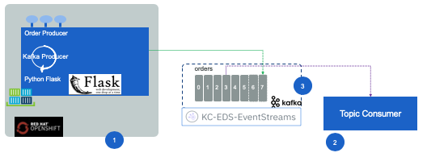

# Kafka order producer with Python and Flask

This is a simple python Flask web app example to expose REST end points and to produce event to kafka. It exposes a POST operation for creating a shipment order and publishes an "order created" event to kafka. The events are sent to the kafka topic `orders` created in IBM Event Stream service on IBM Cloud.

This sample is used to validate an IBM Cloud Event Stream deployment, with this code running in an Openshift cluster using a source to image deployment model.

The high level view of the solution may look like the figure below:



1. The application this repository is doing. This readme explains how to deploy it on Openshift.
1. The order consumer runs locally on the developer machine, and is here to validate tests
1. The Kafka deployment is IBM Cloud Event Stream service.

The application (1) exposes two APIs:

* GET /order to get an order by id
* POST /order to create an order

There is no persistence, only a key-value map in memory.

When the order creation command is performed, an event is published to the kafka broker on the `orders` topic. The KcProducer.py defines a class to produce message. It uses different options depending of the type of deployment used for Kafka (Local or On Cloud). 

## Build and run on OpentShift

To deploy the code to an openshift cluster do the following:

1. Login to the openshift cluster. 

    ```
    oc login -u apikey -p <apikey> --server=https://...
    ```

1. Create a project if not done already:

    ```
    oc  new-project order-producer-python --description="A kafka producer with python"
    ```

1. Create an app from the source code, and use source to image build process to deploy the app:

    ```
    oc new-app python:latest~https://github.com/jbcodeforce/order-producer-python -name order-producer-python
    ```

    Then to track the deployment progress:
    ```
    oc logs -f bc/order-producer-python
    ```
    The dependencies are loaded, the build is scheduled and executed, the image is uploaded to the registry, and started.

1. To display information about the build configuration for the application:

    ```
    oc describe bc/order-producer-python
    ```

    You can see details of the Git repository being used as the source for any build, and a Webhook URL that can be configured into a Git hosting service to trigger a new build automatically when changes are committed and pushed up to a Git repository. 

    For all webhooks, you must define a Secret with a key named WebHookSecretKey and the value being the value to be supplied when invoking the webhook. The webhook definition must then reference the secret. The secret ensures the uniqueness of the URL, preventing others from triggering the build. The value of the key will be compared to the secret provided during the webhook invocation. See [this note](https://docs.openshift.com/container-platform/3.9/dev_guide/builds/triggering_builds.html) for detail. 

1. To trigger a build from local source code

    ```
    oc start-build order-producer-python --from-file=.
    ```

1. Set environment variables

    For Broker URLs
    ```
    oc set env dc/order-producer-python KAFKA_BROKERS=kafka03-prod02.messagehub.services.us-south.blu....
    ```

    For apikey:
    ```
    oc set env dc/order-producer-python KAFKA_APIKEY=""
    ```

    For the kafka runtime env: 

    ```
     oc set env dc/order-producer-python KAFKA_ENV="IBM_CLOUD"
    ```

    Get all environment variables set for a given pod: (det the pod id with `oc get pod`)

    ```
    oc set env pod/order-producer-python-4-tq27j --list
    ```

Running the scripts/setenv.sh will set those environment variables. (Set the environment variable for the kafka broker end points, and the API key in the setenv-tmpl.sh and rename the scripts as setenv.sh )

## Run integration test

Once the application is deployed, we can see the log using the pod name:

```
kubectl get pod
kubectl logs <podename>
```

Then the script to create an order:

```
./scripts/createOrder.sh <hostname> <orderid>
./scripts/createOrder.sh orderwebaproute-reefershipmentsolution.apps.green-with-envy.ocp.csplab.local o01
```

You should see something like:
```
* TCP_NODELAY set
* Connected to order-producer-python-reefer-shipment-solution.greencluster-fa9ee67c9ab6a7791435450358e564cc-0001.us-east.containers.appdomain.cloud (169.60.125.202) port 80 (#0)
> POST /order HTTP/1.1
> Host: order-producer-python-reefer-shipment-solution.greencluster-fa9ee67c9ab6a7791435450358e564cc-0001.us-east.containers.appdomain.cloud
> User-Agent: curl/7.54.0
> accept: */*
> Content-Type: application/json
> Content-Length: 436
> 
* upload completely sent off: 436 out of 436 bytes
< HTTP/1.1 200 OK
< Server: gunicorn/19.9.0
< Date: Tue, 23 Jul 2019 05:04:23 GMT
< Content-Type: application/json
< Content-Length: 454
< Set-Cookie: 8e40f5e10df2bbc133b5dd2c4c66e9e0=2c6644b46de09626eee6dcb9ebf9fbd9; path=/; HttpOnly
< 
{"orderID":"o01","payload":{"customerID":"GoodManuf","destinationAddress":{"city":"Shanghai","country":"China","state":"NE","street":"1 a new street","zipcode":"090"},"expectedDeliveryDate":"2019-03-31T13:30Z","orderID":"o01","pickupAddress":{"city":"Oackland","country":"USA","state":"CA","street":"100 Main street","zipcode":"95053"},"pickupDate":"2019-01-25T13:30Z","productID":"Carrot","quantity":10000},"timestamp":1555149614,"type":"OrderCreated"}
```

To consume the event rom the orders topic, run the code TraceOrders.py. For that purpose use the script:

```
./scripts/runConsumer.sh 
```

Which start a python shell with some predefined library. 

```
root@bae80916ee6d:/home#  pip install -r requirements.txt
```

Then start the consumer to listen to order with the given key

```
root@bae80916ee6d:/home# python TraceOrders.py o01

Start to listen to events
@@@ pollNextEvent orders partition: [0] at offset 835 with key b'o01':

@@@ pollNextEvent Received message: {"orderID": "o01", "timestamp": 1555149614, "type": "OrderCreated", "payload": {"orderID": "o01", "productID": "Carrot", "quantity": 10000, "customerID": "GoodManuf", "expectedDeliveryDate": "2019-03-31T13:30Z", "pickupDate": "2019-01-25T13:30Z", "pickupAddress": {"street": "100 Main street", "city": "Oackland", "country": "USA", "state": "CA", "zipcode": "95053"}, "destinationAddress": {"street": "1 a new street", "city": "Shanghai", "country": "China", "state": "NE", "zipcode": "090"}}}
@@@@ got the matching expected key 
```

## Some implementation considerations

The configuration for kafka is based on [librdkafka library](https://github.com/edenhill/librdkafka/blob/master/CONFIGURATION.md).

The producer configuration looks like:

```
options ={
            'bootstrap.servers':  self.kafka_brokers,
            'group.id': groupID,
            'security.protocol': 'sasl_ssl',
             'sasl.mechanisms': 'PLAIN',
             'ssl.ca.location': '/etc/pki/tls/cert.pem',
             'sasl.username': 'token',
             'sasl.password': self.kafka_apikey,
}
```


## Build and run locally

To build with s2i CLI:

```
s2i build --copy .  centos/python-36-centos7 ibmcase/orderproducer
```

To run locally

```
docker run -p 8080:8080 ibmcase/orderproducer
```
